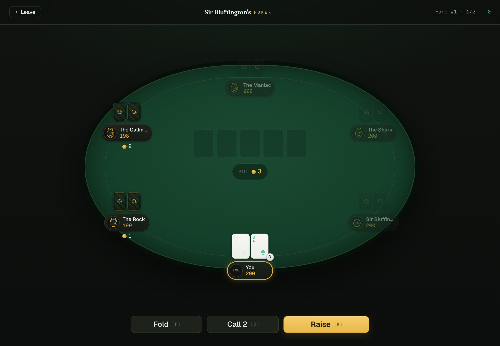

<div align="center">

# ♠ Sir Bluffington's Poker

**A free, browser-based No-Limit Hold'em trainer where the bots have opinions.**

Practice poker against five hand-tuned AI personalities — from the nitty *Rock* to the monocled menace himself. No account, no download, no money. Just deal.

[**▶ Play it**](https://sirbluffington.pages.dev) · [Decisions](DECISIONS.md) · [Setup](SETUP.md)



</div>

---

## Why this exists

The open web is weirdly missing a good single-player poker trainer. Everything is either multiplayer (you need friends and a schedule), a paid GTO solver (you need a subscription and a PhD), or a mobile app (you need to install it). Sir Bluffington's Poker is the thing in the gap: **open a tab, sit down, play a thousand hands against opponents you can actually read.**

The bots aren't a faceless "AI." They're five distinct characters with different leaks, so you learn the thing that actually matters — reading tendencies and exploiting them — instead of memorizing a chart.

## Meet the table

| Bot | Style | Tell |
| --- | --- | --- |
| **The Rock** | Folds unless he's holding the nuts | Bet at him and watch him disappear. Steal his blinds. |
| **The Calling Station** | Never met a bet she didn't call | Value bet relentlessly. Never, ever bluff her. |
| **The Maniac** | Raises now, thinks never | Sit back, let him bloat the pot, snap him off with a real hand. |
| **The Shark** | Balanced, positional, patient | The one who plays you back. Respect the aggression. |
| **Sir Bluffington** | The monocled menace — adaptive, tricky, full of it | The boss. Bluffs, adapts, and will absolutely level you. |

Every decision is a rule-based function of hand equity, pot odds, position, and personality — with a dash of noise so you can't beat them by rote. No LLM, no server, no latency. [How the AI works →](DECISIONS.md#the-bots-are-rule-based-on-purpose)

## Features

- **Real No-Limit Hold'em** — heads-up, 6-max, or full ring. Cash or escalating-blind (tournament) structure.
- **A correct engine.** Multiway side pots, the min-raise "no-reopen" rule, the heads-up button exception, split pots with odd-chip distribution — all of it, verified by an actual test suite (see below).
- **Post-hand review** — every showdown reveals the bots' cards, the pot distribution (including each side pot), and a one-line *why* for the notable plays. "The Maniac bluffed the river." "The Rock folded — only plays premium hands."
- **Live equity** via Monte-Carlo rollouts, computed in a web worker so the table never stutters.
- **Stats that stick** — hands played, showdown win %, biggest pot, net chips, and your head-to-head record vs each bot, saved in your browser.
- **Keyboard-first** — `F` fold, `C` check/call, `R` raise, `Enter` to confirm / deal the next hand.
- Dark, engineered UI. Four-color or two-color deck. Reduced-motion respected.

## The hard part: pot math

Side pots are where poker engines go to die. This one treats them as the acceptance test. The [side-pot layering](src/engine/sidepots.ts) and [showdown award](src/engine/showdown.ts) were written **test-first** against the spec's exact matrix, and chip conservation is fuzz-tested across 400 randomized hands:

```
✓ 3-way all-in, three stack sizes → main + two side pots
✓ uncalled overbet returns to its owner
✓ all-in call for less than a full raise
✓ short all-in does NOT reopen betting          ← the classic bug, tested
✓ heads-up: button posts SB and acts first preflop
✓ split side pot with odd chip to first seat left of the button
✓ chip conservation across 400 random hands of 2–9 players
```

**37 tests, zero pot-math errors.** That's the whole point.

## Run it locally

Requires Node 20+.

```bash
npm install
npm run dev          # → http://localhost:5173
```

That's it — no env file, no keys, no services. The app is entirely client-side.

Other scripts:

```bash
npm test             # run the Vitest suite
npm run check        # typecheck + lint + test
npm run build        # production build → dist/
npm run gen:preflop  # regenerate the 169-bucket preflop equity table (only if re-tuning)
```

## Deploy

Static build → [Cloudflare Pages](https://pages.cloudflare.com) (free, zero egress). One command:

```bash
npm run deploy       # builds and runs `wrangler pages deploy`
```

Full walkthrough in [SETUP.md](SETUP.md). It'll land at `https://<project>.pages.dev` — no origin server, no bill.

## How it's built

```
src/
  engine/    Pure NLHE rules — cards, betting state machine, side pots, showdown, hand loop
  ai/        Rule-based personalities, preflop equity table, Monte-Carlo, decision fn, worker
  game/      Runtime controller, localStorage stats/config, React hook (the only stateful layer)
  ui/        React components — felt table, seats, action bar, post-hand review, mascot, cards
  styles/    Design tokens + base styles
test/        37 tests — engine correctness, AI distinctness, full-session integration
```

**Stack:** React + TypeScript (strict) + Vite. [`pokersolver`](https://github.com/goldfire/pokersolver) (MIT) for hand ranking, behind a swappable interface. Everything else — the betting engine, side-pot math, the bots — is original and deterministic. Biome for lint/format, Vitest for tests, GitHub Actions for CI. The full rationale, including the adopt-vs-build audit, is in [DECISIONS.md](DECISIONS.md).

## Not gambling

Play money only. No real currency, no purchasable chips, no accounts, no data collection. Just a place to get reps. Poker and "Texas Hold'em" are generic; the bots and art are original.

## License

MIT — see [LICENSE](LICENSE). `pokersolver` is MIT.
